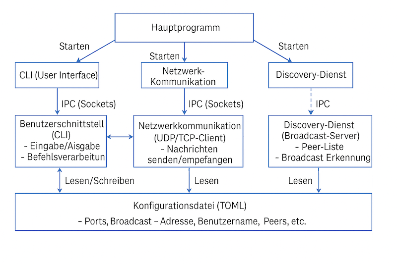
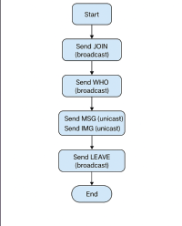
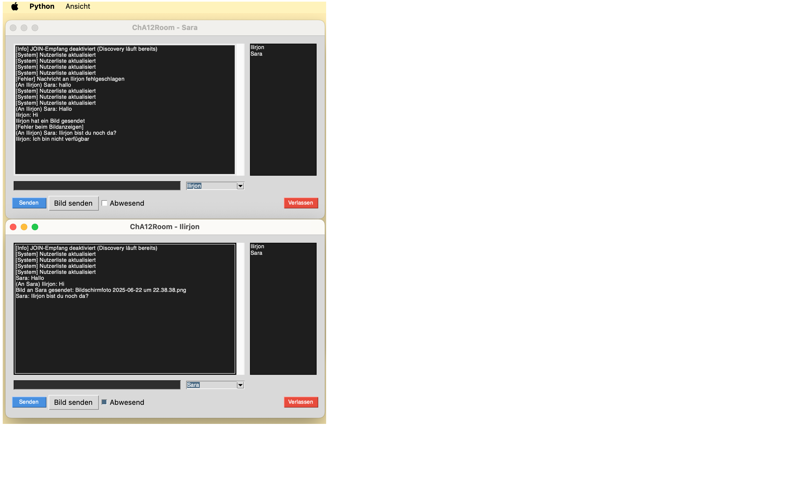

# P2P Chatprogramm (BSRN Projekt SS2025)

Dies ist ein Peer-to-Peer (P2P) Chatprogramm, das im Rahmen des Moduls *Betriebssysteme und Rechnernetze* entwickelt wurde. Es ermöglicht dezentrale Kommunikation im lokalen Netzwerk ohne zentrale Serverinstanz.

## 1. Installation und Nutzung

### Voraussetzungen

- Python 3.10 oder höher (getestet unter Linux und macOS)
- `toml`-Modul: `pip install toml`
- pip install toml pillow

### Schritte

1. Repository klonen und in das Projektverzeichnis wechseln
2. Datei `config.toml` anpassen (Handle, Ports, Autoreply, Speicherpfad für Bilder)
3. Programm starten via:

```bash
python3 main.py
```

## 2. Features

- Benutzerdefinierte Handles (Benutzernamen)
- Lokale Discovery über `WHO`, `JOIN`, `LEAVE`
- P2P-Kommunikation per TCP/UDP
- Textnachrichten (MSG) und Bildübertragung (IMG)
- Automatische Abwesenheitsnachrichten(Autoreply) 
- Konfigurierbare Ports und Einstellungen per `.toml`-Datei
- CLI-Schnittstelle + optionale GUI


## 3. Architektur

Das System ist modular in **drei Prozesse** aufgeteilt:

- **Benutzer-Schnittstelle (CLI/GUI)** 
  Eingabe von Nachrichten, Anzeige empfangener Inhalte, Konfiguration
- **Netzwerk-Kommunikation** 
  Versand und Empfang von Text- und Bildnachrichten über TCP/UDP
- **Discovery-Dienst** 
  Lokale Teilnehmererkennung und Verwaltung über Broadcast (JOIN, WHO, LEAVE)

Die Prozesse kommunizieren über lokale UDP/TCP-Sockets. Einstellungen erfolgen zentral über eine TOML-Datei.

### Architekturdiagramm



## 4. Protokoll (SLCP)

Das Simple Local Chat Protocol (SLCP) definiert die Kommunikation:

| Befehl      | Beschreibung                                    |
|-------------|-------------------------------------------------|
| `JOIN`      | Teilnehmer meldet sich über Broadcast an        |
| `LEAVE`     | Teilnehmer verlässt Chat, informiert alle       |
| `WHO`       | Fragt aktive Teilnehmer per Broadcast ab        |
| `KNOWNUSERS`| Antwort auf WHO mit Liste bekannter Nutzer      |
| `MSG`       | Textnachricht an einzelnen Nutzer per TCP       |
| `IMG`       | Bildnachricht mit anschließenden Binärdaten     |

**Beispiel:**  
```
JOIN Sara 5000
MSG Ilirjon "Hallo, wie geht’s?"
IMG Ilirjon 35463
```


## 5. Designentscheidungen und Ansätze

- **Python**: schnelle Entwicklung, gute Bibliotheksunterstützung
- **Prozess-Trennung**: klare Aufgabenteilung, einfache Wartung
- **Konfiguration via TOML**: zentral, lesbar, leicht anpassbar
- **CLI + GUI**: flexibel für Nutzerbedürfnisse
- **UDP Broadcast + TCP Unicast**: ideal für lokale Netze


## 6. Kommunikationsabläufe

- **JOIN**:  
  Neue Clients melden sich über UDP-Broadcast beim Discovery-Dienst an  
- **WHO/KNOWNUSERS**:  
  Clients fordern bekannte Nutzer an, Discovery-Dienst antwortet  
- **MSG/IMG**:  
  Unicast-Nachrichten zwischen Clients (Text oder Bilddaten)


## 7. Besondere Herausforderungen & Lösungen

| Problem                             | Lösung                                         |
|-------------------------------------|------------------------------------------------|
| Mehrfachstart des Discovery-Diensts | Überprüfung und Vermeidung doppelter Instanzen |
| Synchronisation bei Bildübertragung | Byte-genaue Übertragung gemäß `Size`           |
| Netzwerkunterbrechungen             | Fehlerbehandlung und automatische Reaktion     |
| Konfigurationsänderung zur Laufzeit | Anpassung über CLI möglich                     |


## 8. Bedienung und Konfiguration

- **Start**:
  ```bash
  python3 main.py
  ```
- **Konfiguration**: Datei `config.toml`, z. B.:
  ```toml
  handle = "Sara"
  port = [5200, 5201]
  whoisport = 4000
  autoreply = "Ich bin gerade abwesend"
  imagepath = "./Bilder"
  ```

- **CLI-Befehle**:
  ```
  /msg Bob "Hallo Bob"
  /img Bob pfad/zum/bild.jpg
  /nutzer
  exit
  ```


## 9. Erweiterungsmöglichkeiten

- Erweiterte GUI mit Drag&Drop für Bilder
- Gruppen-Chats mit mehreren Teilnehmern
- Ende-zu-Ende-Verschlüsselung
- Integration eines Bildbetrachters
- Plattformunabhängige Installer

## 10. Anhang

### Diagramme

- Ablaufdiagramme für JOIN, WHO, MSG etc.




### Screenshots

- Beispielhafte Darstellung der GUI  



- Beispielhafte Anzeige empfangener Nachrichten 


## 11. Dokumentation

Der Quellcode ist mit Doxygen-kompatiblen Kommentaren versehen.  
Die generierte Dokumentation befindet sich im Ordner `/docs`.

```bash
doxygen Doxyfile
```

Ergebnis: `docs/html/index.html` im Browser öffnen.

**Hinweis für macOS-Nutzer:** Falls `python3` bei euch nicht Python 3.11 startet, kann folgender Alias lokal gesetzt werden:

```bash
echo 'alias python3="python3.11"' >> ~/.zshrc && source ~/.zshrc
```
